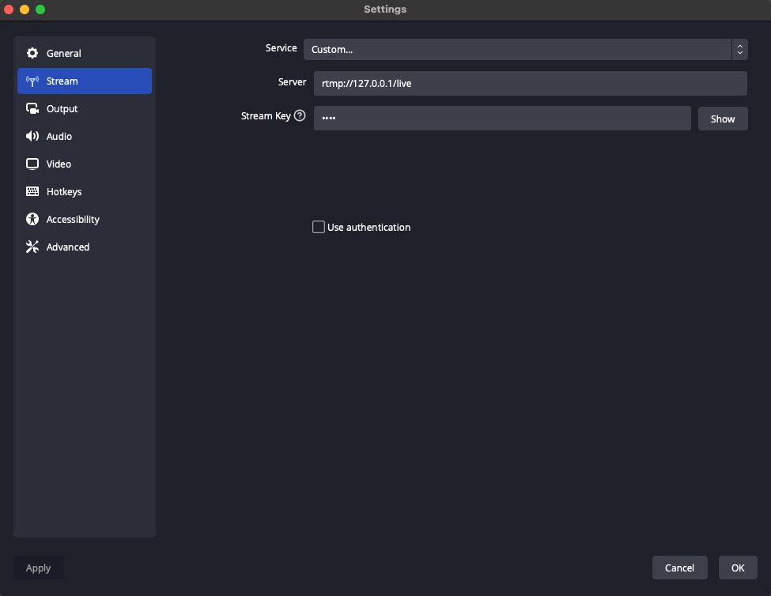

**Assetto Corsa** is a racing simulation game that allows players to drive a variety of cars on different tracks. 

## Running the game

- We will be using a compatability tool called [Crossover](https://www.codeweavers.com/crossover) by the [CodeWeavers team](https://www.codeweavers.com/) as Assetto Corsa is a Windows only application.
- They offer a 14-day trial. A perpetual license is $74 USD at the time of writing, this licsense can be used for all operating systems according to their FAQ.
- Once the application is installed, go to the "Install" tab and search for "Assetto Corsa", and essentially click yes to everything. It will build a 'container' with steam, which then will prompt you to login, then you can launch Assetto Corsa. 
- If you do not have Assetto Corsa, then it is available via [Humble Bundle](https://www.humblebundle.com/store/assetto-corsa) or [Steam](https://store.steampowered.com/app/244210/Assetto_Corsa/).


## Game capture

### Screen/Window Capture

**FFmpeg** is a free and open-source command-line tool for processing multimedia files. It can be used to capture and stream video from a variety of sources.

**Open Broadcasting Software (OBS)** is a free and open-source software for video recording and live streaming. It can be used to capture and stream the video output of a specific window, such as the Assetto Corsa game.

### Reading the video stream and processing the live frames

**Real-Time Messaging Protocol (RTMP)** is a protocol for streaming audio, video, and data over the internet. In this tutorial, we will be using an RTMP server to receive the video stream from FFmpeg or OBS and make it available for python to consume.

**Python** is used to read and process the video stream from the RTMP server. We will be using the opencv-python library to connect to the RTMP server and display the video stream in real-time.

### FFmpeg

#### M1 MacOS

```bash
$ ffmpeg -f avfoundation -list_devices true -i ""
...
[AVFoundation indev @ 0x126e04d50] AVFoundation video devices:
[AVFoundation indev @ 0x126e04d50] [0] OBS Virtual Camera
[AVFoundation indev @ 0x126e04d50] [1] FaceTime HD Camera
[AVFoundation indev @ 0x126e04d50] [2] Capture screen 0
[AVFoundation indev @ 0x126e04d50] [3] Capture screen 1
[AVFoundation indev @ 0x126e04d50] [4] Capture screen 2
[AVFoundation indev @ 0x126e04d50] AVFoundation audio devices:
[AVFoundation indev @ 0x126e04d50] [0] MacBook Pro Microphone
```

```bash
$ sudo nice -n -20 ffmpeg \
    -f avfoundation \
    -framerate 30 \
    -i "2" \
    -c:v libx264 \
    -preset ultrafast \
    -tune zerolatency \
    -f flv "rtmp://127.0.0.1/live/test"
```
`sudo nice -n -20`: Changes the priority of the ffmpeg process, this will increase how much CPU time it receives. -20 is the highest priority. 
`-f avfoundation`: This option tells FFmpeg to use the avfoundation input device, which allows capturing the screen on a Mac.
`-framerate 30`: This option sets the frame rate of the captured video to 30 frames per second.
`-i "2"`: This option specifies the input device to use, in this case, the zeroth screen.
`-c:v libx264`: This option tells FFmpeg to use the H.264 codec for the video stream.
`-preset ultrafast`: This option tells FFmpeg to use the "ultrafast" preset for the H.264 encoder, which prioritizes speed over quality.
`-tune zerolatency`: This option tells FFmpeg to optimize the video stream for low latency.
`-f flv`: This option tells FFmpeg to use the FLV format for the video stream.
`rtmp://your-rtmp-server-url/optional-rtmp-key`: This is the URL of the RTMP server where the video stream will be sent to. The key lets you have one machine hosting a unique output stream.

We need streams to be as realtime as possible, so when using ffmpeg you should see a `speed=1x`
```bash
frame= 6654 fps=30 q=31.0 Lsize=193437kB time=00:03:42.03 bitrate=7136.9kbits/s speed=1x
```

#### Linux

Should be similar to Mac, but with a different capture tool. I.e. it wont be `avfoundation` as this is only for Apple devices, but likely will work `x11grab` which intercepts the directX framebuffer (citation needed).

```bash
$ ffmpeg \
	-f x11grab \
	-framerate 30 \
	-i "1" \
	-c:v libx264 \
	-preset ultrafast \
	-tune zerolatency \
	-f flv "rtmp://127.0.0.1/live/test"
```
`-f x11grab`: This option tells FFmpeg to use the X11 screen capture input device. This option allows FFmpeg to capture the entire screen or a specific window.
`-framerate 30`: This option sets the frame rate of the captured video to 30 frames per second.
`-i "1"`: This option specifies the input device to use, in this case, it is the X11 display number.
`-c:v libx264`: This option tells FFmpeg to use the H.264 codec for the video stream.
`-preset ultrafast`: This option tells FFmpeg to use the "ultrafast" preset for the H.264 encoder, which prioritizes speed over quality.
`-tune zerolatency`: This option tells FFmpeg to optimize the video stream for low latency.
`-f flv` : This option tells FFmpeg to use the FLV format for the video stream.    
`rtmp://127.0.0.1/live/test`: This is the URL of the RTMP server where the video stream will be sent to.

- [ ] Test that these settings actually work on James' PC

### Open Broadcast Software
If FFMPEG doesn't work, then this is a backup, as it seems to have a ~0.3-0.7ms overhead (at least on my M1 Mac).

Side note, [OBS websockets](https://github.com/obsproject/obs-websocket#client-software) can be used to automate this step but it might take some work. I think investing time into a *faster* ffmpeg solution is the way right now.

1. Get the thing https://obsproject.com/download
2. Start the Assetto Corsa game, setting it to window mode is optional.
3. Open OBS and add a new "Window Capture" source under the "Depricated" menu for the Assetto Corsa game window.
![[selecting_a_source.png]]
5. In the OBS settings, go to the "Stream" tab and set the "Streaming Service" to "Custom" and the "Server" to "rtmp://your-rtmp-server-url".

7. Optionally, you can finetune some settings in OBS. Note the separate Streaming vs Recording settings, I haven't really bothered with recording yet so this will likely change!
![[settings_output_simple.png]]
9. Click "Start Streaming" to start the streaming under the "Controls Tab".
![[controls_tab.png]]


