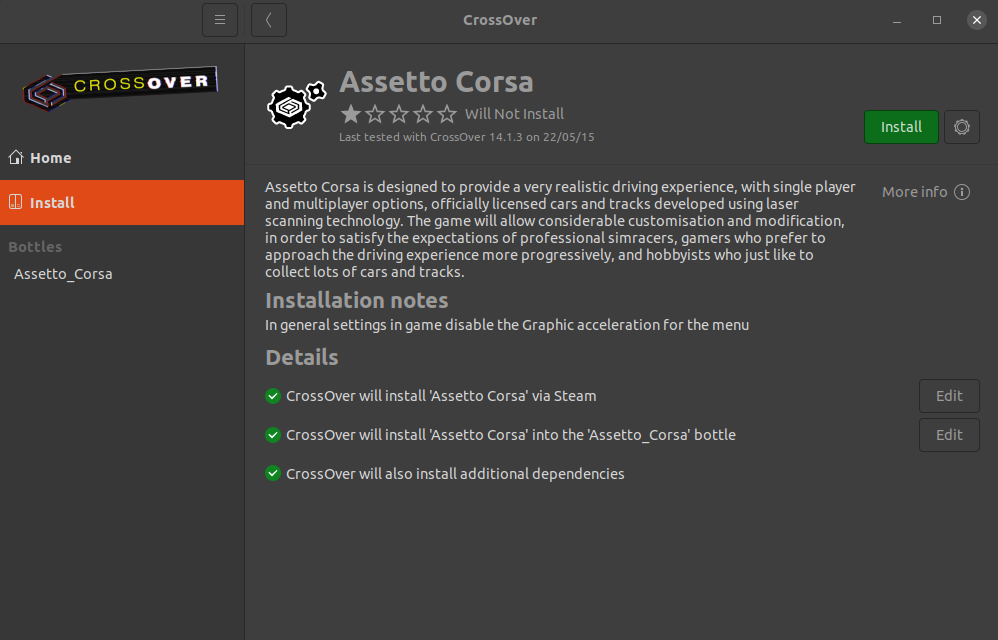

# Assetto Corsa, a new racing benchmark


**Assetto Corsa** is a racing simulation game that allows players to drive a variety of cars on different tracks. 


## Creating the bottle
We will be using a compatability tool called [Crossover](https://www.codeweavers.com/crossover) by the [CodeWeavers team](https://www.codeweavers.com/) as Assetto Corsa is a Windows only application. They offer a 14-day trial. A perpetual license is $74 USD at the time of writing, this licsense can be used for all operating systems according to their FAQ.


## Running the game

- Do not install Steam if you see it, installing Assetto Corsa will install steam in it's own bottle.
- Once the application is installed, go to the "Install" tab and search for "Assetto Corsa". You should see the image below.
	- Click yes to everything. .NET 2.0 does not install correctly so just skip this step when prompted. 
	- It will build a 'container' (this is called a "[bottle](https://news.ycombinator.com/item?id=29613303#:~:text=software%20on%20...-,Bottles%20are%20isolated%20Wine%20environments%2C%20similar%20to%20containers%20or%20VMs,%2C%202021%20%7C%20next%20%5B%E2%80%93%5D)", see [Wine](https://www.winehq.org/) for details).
	- **IMPORTANT** when prompted to start steam during the install, click yes and sign in. Not doing this step will result in installation being broken. Once you have signed in it will prompt you to install AC.
- If you do not have Assetto Corsa, then it is available via [Humble Bundle](https://www.humblebundle.com/store/assetto-corsa) or [Steam](https://store.steampowered.com/app/244210/Assetto_Corsa/).



Open AC and drive with a car checking that everything is working as expected.

## Additional Setup

<details>
	<summary>Linux</summary>


### Game State
AC has to run in WINE which means we cannot directly access the game state via shared memory.
To get around this we use a python script running inside the same WINE instance as the game to access the game state which it then makes available to the host OS via a socket.
Crossover doesn't come with python so first we need to install that using the `Install an unlisted application` button in the `Install` tab.
When installing python select to install it for all users in the Advanced Menu.


Now we should be able to call python and its related packages from the bottle's command line.
To verify this, in crossover click `Run Commnad` and in the `Command` field type `python`, this should launch your Python (version 3.11 in our example) interactive terminal. 


Navigate to the root directory of the package and run:
```
/opt/cxoffice/bin/wine --bottle Assetto_Corsa --cx-app cmd.exe
```
To access the command line inside the bottle.
Then install ac interface it into the bottle by running:
```
pip install loguru numpy
pip install -e .
```
	
In linux, do this to make sure the python uinput module has access to the kernel uinput module. 
```bash
sudo modprobe uinput
sudo chmod a+r+w /dev/uinput
```

Additionally, if the game resolution is set to be the same as your windowed resolution, i.e. you have a 1920x1080 screen, and in AC you disable fullscreen mode (enabling windowed mode) and set the resolution to be 1920x1080, AC will ignore your windowed mode request and thus our scripts won't be able to do game capture. So you will need to set the game resolution to something smaller than your display, i.e. 1920x1080 screen, so 1600x900 game resolution. 
You will need to go into `src/config/capture/game_capture.yaml` and change the resolution to the one chosen in game.

### Recording
To write out image files faster we need to make sure an additional package is installed by running `sudo apt-get install libturbojpeg` prior to running `make build`.


</details>


# AC Interface
## Defining an Agent
To define your own and allow it to control a car in the game create a class that inherits from `src.interface.AssettoCorsaInterface` and define a function named `behaviour(self, observation: Dict) -> np.array`.
To test your agent create a main method that instances your new Agent class and calls `agent.run()`.
As an example here is an agent that does nothing:
```
from src.interface import AssettoCorsaInterface

class MyCoolAgent(AssettoCorsaInterface):
	def behaviour(self, observation: Dict) -> np.array:
		return np.array([0.0, 0.0, 0.0])

if __name__=="__main__":
	agent = MyCoolAgent()
	agent.run()
```
More examples of how to do this can be found in the /examples folder.

## Record A Game Session
An example of using our interface to record a game session is:
```
from src.recorder import AssettoCorsaRecorder


if __name__ == "__main__":
    save_path = "./test/monza_audi_r8_lms_1"
	recorder = AssettoCorsaRecorder()
    recorder.run(save_path)
```
To finish recording use a keyboard interrupt (crt+c) on the terminal running the script.
