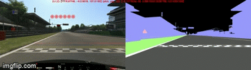
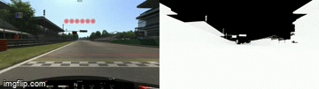
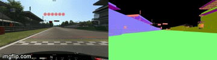

# Ground Truth Data Generation Toolkit
Using data sources from the games static files we have developed a series of generators for common machine learning vision tasks.
In `generate_data.py` the `DataGenerator` class can be configured to iterate over samples in a folder made by the interfaces recording harness.
For each frame, or a sub sampling of frames, it can generate semantic segmentation maps, normal maps and depth maps from the perspective of the car when a sample was recorded.

Each track needs to be manually inspected and a file with associated constants created prior to being able to use the generator, see `tracks/monza.py`.
Introduction of a new map requires each vertex groups semantic label to be decided on, any vertex groups that should be removed and any that require their materials to be modified so they are distinguishable from an important class.
We usually open the mesh in blender to inspect any classes that are ambiguous and progressively refine them based on visualisation of the coded rules.
It can be helpful to assemble the data into a video with the raw capture on the left and the generated data on the right using `test_video.py` script.